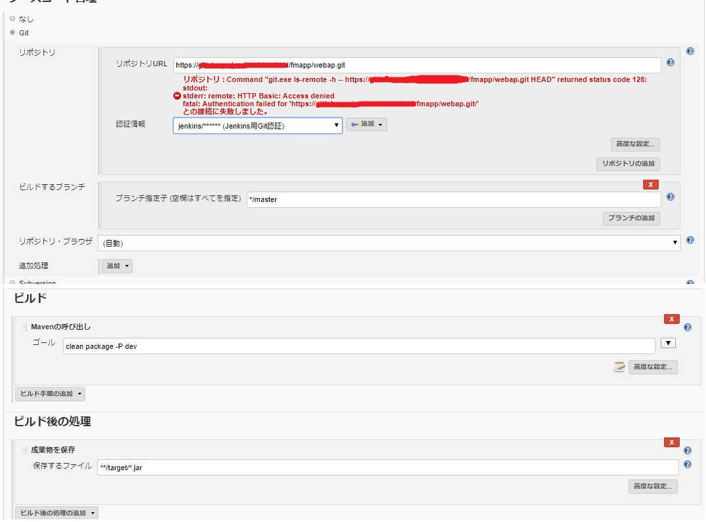

# Jobcopy Builderによるジョブコピー方法

## 必要なプラグイン
下記プラグインとそのプラグインが必要とするプラグインをインストールする。
|名前|URL|Wiki|
|---|---|---|
|Jobcopy Builder plugin|https://plugins.jenkins.io/jobcopy-builder|https://wiki.jenkins.io/display/JENKINS/Jobcopy+Builder+plugin|
|Extended Read Permission Plugin|https://plugins.jenkins.io/extended-read-permission|https://wiki.jenkins.io/display/JENKINS/Extended+Read+Permission+Plugin|

## Jenkinsの設定
本プラグインでコピー＆作成を行う場合、下記サイトの`Permissions to copy jobs`に記載されている通り、コピージョブはAnonymous権限で実行される。

https://wiki.jenkins.io/display/JENKINS/Jobcopy+Builder+plugin

また、Anonymous権限に以下の権限を設定する必要がある。

|処理|必要な権限|
|---|---|
|コピー元参照|Jobに対して「Read」「ExtendedRead」|
|コピー先作成(新規)|Jobに対して「Create|
|コピー先作成(上書き)|Jobに対して「Configure」|

そのため、「ExtendedRead」を設定できるように`Extended Read Permission Plugin`をインストールし、権限設定を行う。

1. `Jenkinsの管理`→`グローバルセキュリティの設定`で設定画面を開く
2. Anonymous Usersに以下の通りジョブの`Create``ExtendedRead``Read`の権限を設定する。尚、コピー先ジョブの上書きを行う場合には`Configure`も設定する。

## ジョブの設定
Jobcopy Builderは以下のような処理が可能。これにより、テンプレートジョブを用意しておき、リポジトリURL等を文字列置換することでジョブを作成することが可能。
   - ジョブのコピーする。
   - コピー時にコピー元ジョブの任意の文字列を指定した文字列に置換する。

例として以下のようなジョブの構成とする。

`JobCopy`がコピージョブで、`template-build-xxx`がコピー元となるテンプレートジョブとする。この`template-build-xxx`をコピーしてジョブを作成する場合を説明する。

`template-build-xxx`の設定内容は以下の通りとする。

リポジトリのURLに設定されている`プロジェクト名`と`AP名`、mvnコマンドのプロファイル指定している`環境名`をコピー時に置換することを想定したコピージョブを作成する。

コピージョブを実行時に以下のパラメータを設定して置換を行ってコピーを行う設定とする。
  - ジョブ名
  - プロジェクト名
  - AP名
  - 環境名

まず、実行時に指定するパラメータは以下の通り設定する。

次に、コピー処理部分でパラメータ指定した変数を使用して置換処理を行うように設定する。

このジョブを実行する。

実行が完了するとジョブがコピーされる。

ジョブを確認すると文字列が指定した内容で置換されている。

